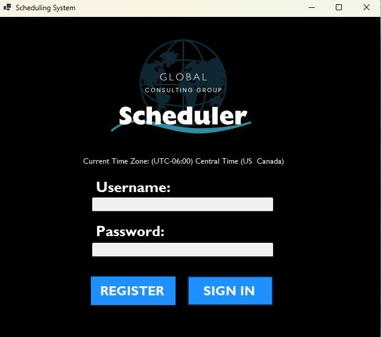
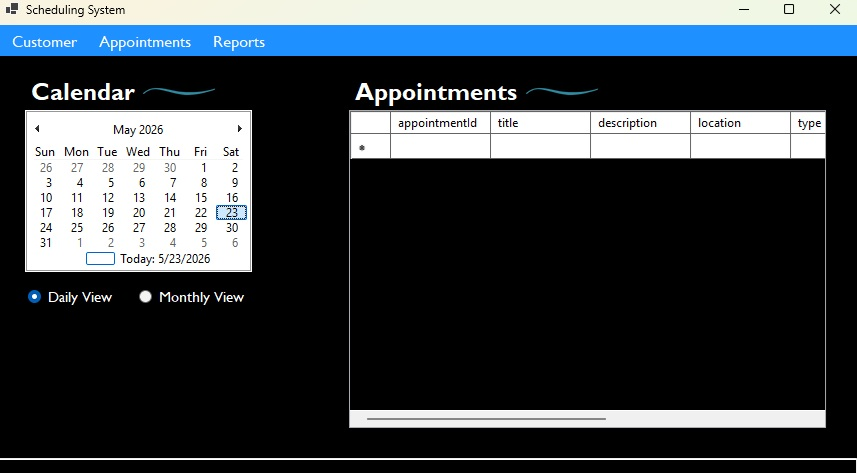
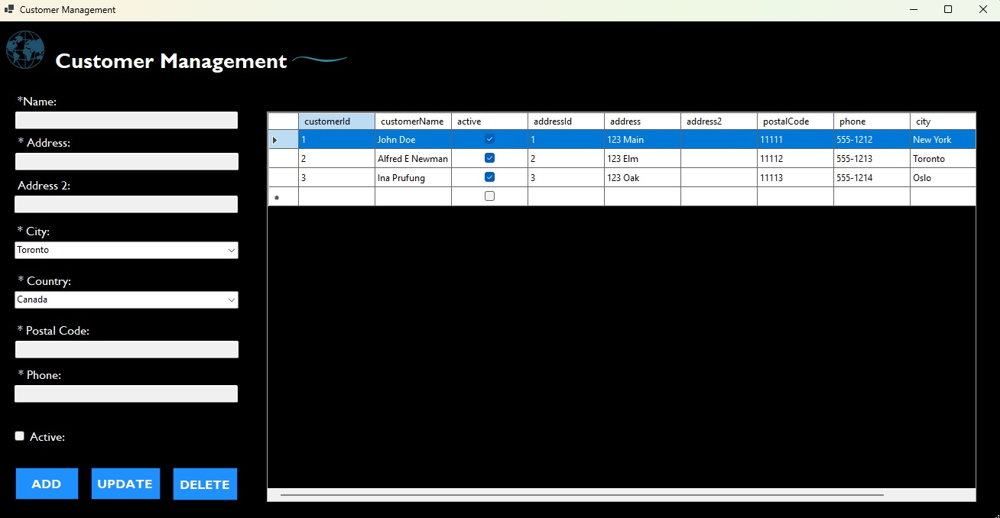
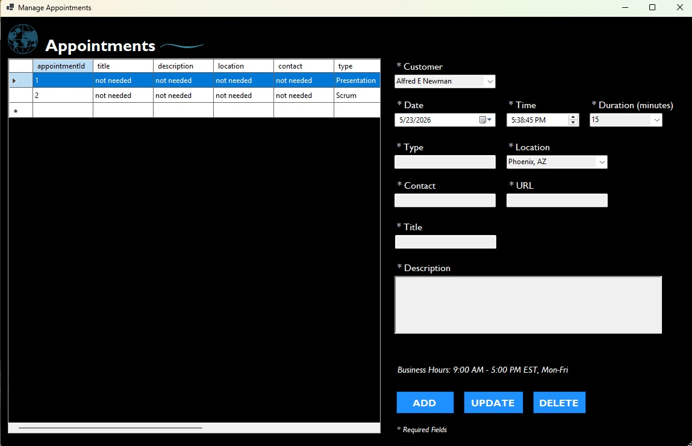
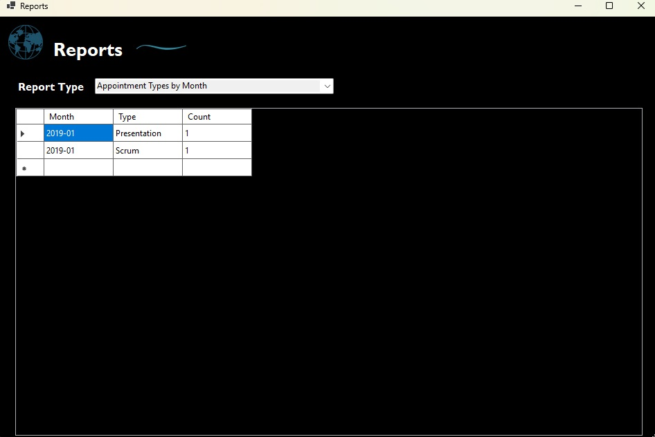

# Scheduling System Application

A desktop scheduling application built with C# and WinForms that allows users to securely manage appointments, customers, and scheduling data through a connected MySQL database.

---

## Features

* Secure user authentication with salted password hashing
* Add, modify, and delete appointments
* Add, modify, and delete customer records
* Calendar and scheduling management
* Appointment conflict checking
* MySQL database integration
* Localized login support (multi-language login screen)
* User-friendly Windows Forms interface
* Input validation and error handling
* Data filtering and reporting functionality

---

## Technologies Used

* **C#**
* **.NET / WinForms**
* **MySQL**
* **Visual Studio 2022**
* **SQL**

---

## Project Structure

```text
SchedulingSystem/
│
├── Data/
│   └── Scheduling_System_DB_Setup.sql
├── DataAccess/
├── Models/
├── Utilities/
├── Services/
├── Forms/
└── Program.cs
```

---

## Installation

### Prerequisites

Before running the application, make sure you have:

* Visual Studio 2022
* .NET SDK installed
* MySQL Server installed and running
* MySQL Workbench (optional)

---

## Database Setup

1. Install and start MySQL Server.
2. Open MySQL Workbench (or another SQL client).
3. Run the SQL setup script located in the `Data` folder:

```text
Data/Scheduling_System_DB_Setup.sql
```

4. The script will automatically:

   * Create the database
   * Create the required tables
   * Insert any starter or test data (if included)

5. Update the application's database connection string with your local MySQL credentials.

Example connection string:

```csharp
server=localhost;
port=3306;
database=scheduling;
user=root;
password=yourpassword;
```

---

## Running the Application

1. Clone the repository:

```bash
git clone https://github.com/yourusername/scheduling-system.git
```

2. Open the solution in Visual Studio 2022.

3. Restore NuGet packages if prompted.

4. Build and run the project.

---

## Authentication

The application uses a secure authentication system with:

* Salted password hashing
* User credential validation
* Login verification
* Localized login support

---

## Application Functionality

### Appointment Management

Users can:

* Create appointments
* Modify appointments
* Delete appointments
* View schedules by date and time
* Prevent overlapping appointments

### Customer Management

Users can:

* Add customers
* Edit customer information
* Delete customers
* Store address and contact information

### Reports

The application includes reporting features such as:

* Appointment types by month
* Schedule for each user
* Appointments by location

---

## Important Notes

This project uses a local MySQL database instance. The actual database is not included in the repository. Instead, a SQL setup script is provided so the database can be recreated locally.

Before running the application:

* Ensure MySQL Server is running
* Execute the SQL setup script
* Update the connection string with your own local credentials

---

## Screenshots





---

## Learning Outcomes

This project demonstrates knowledge and experience with:

* Desktop application development
* Database integration
* CRUD operations
* Secure authentication
* Object-oriented programming
* Data validation
* Exception handling
* Software architecture and organization


